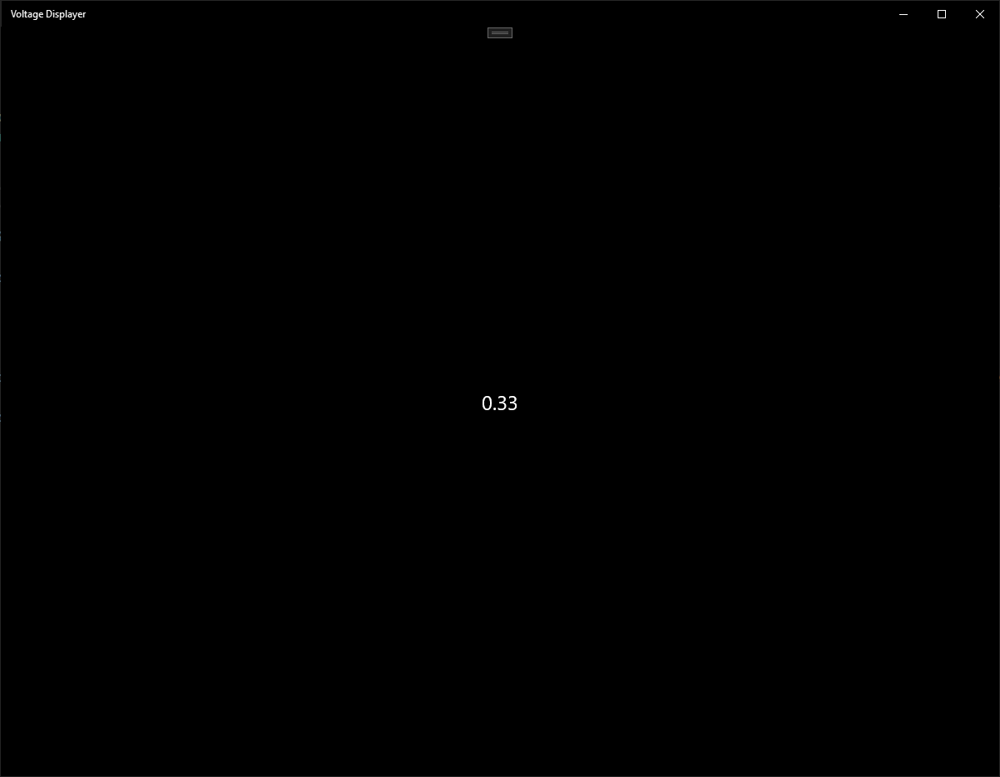
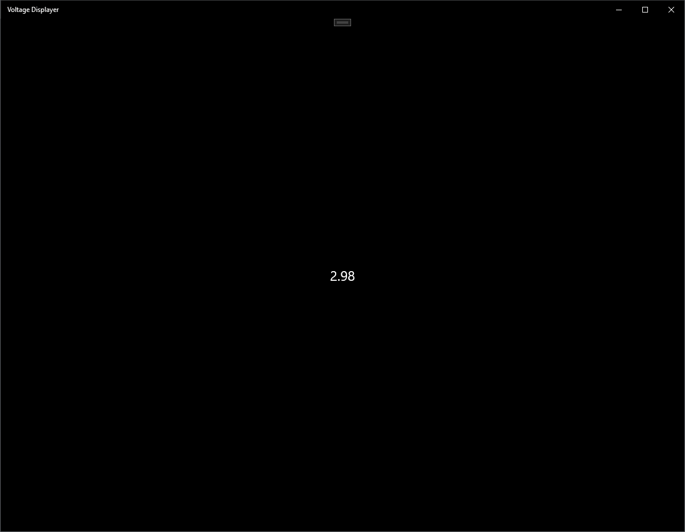
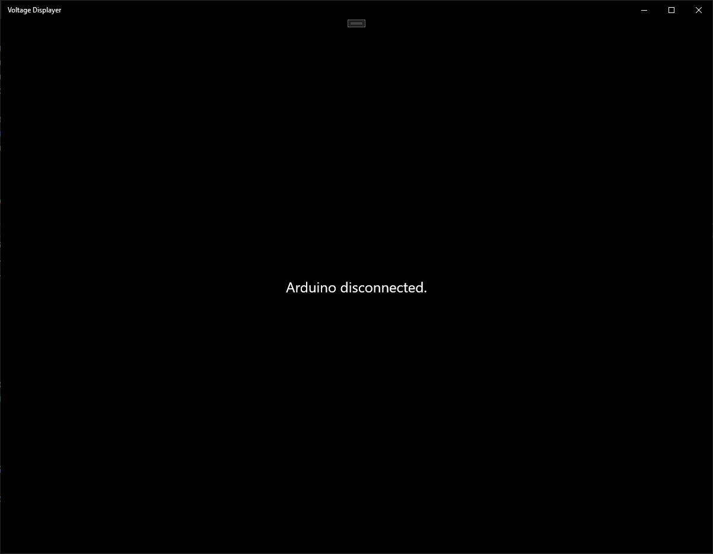

# VoltageMeter

A simple UWP app to show a voltage measured by an Arduino, sent over UART.

Code for the arduino can be found on [camielverdult/ADC-to-UART](https://github.com/camielverdult/ADC-to-UART).

## Screenshots

